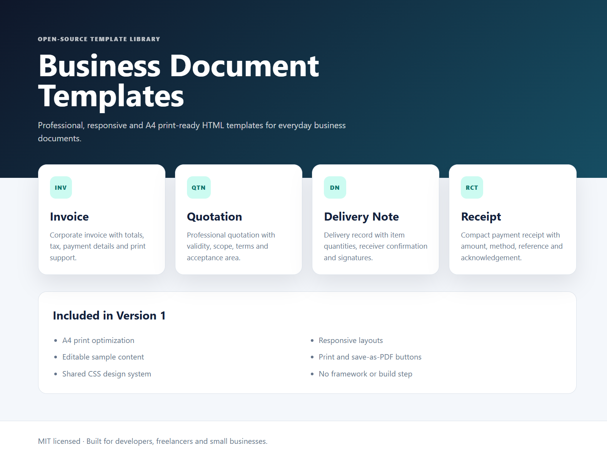
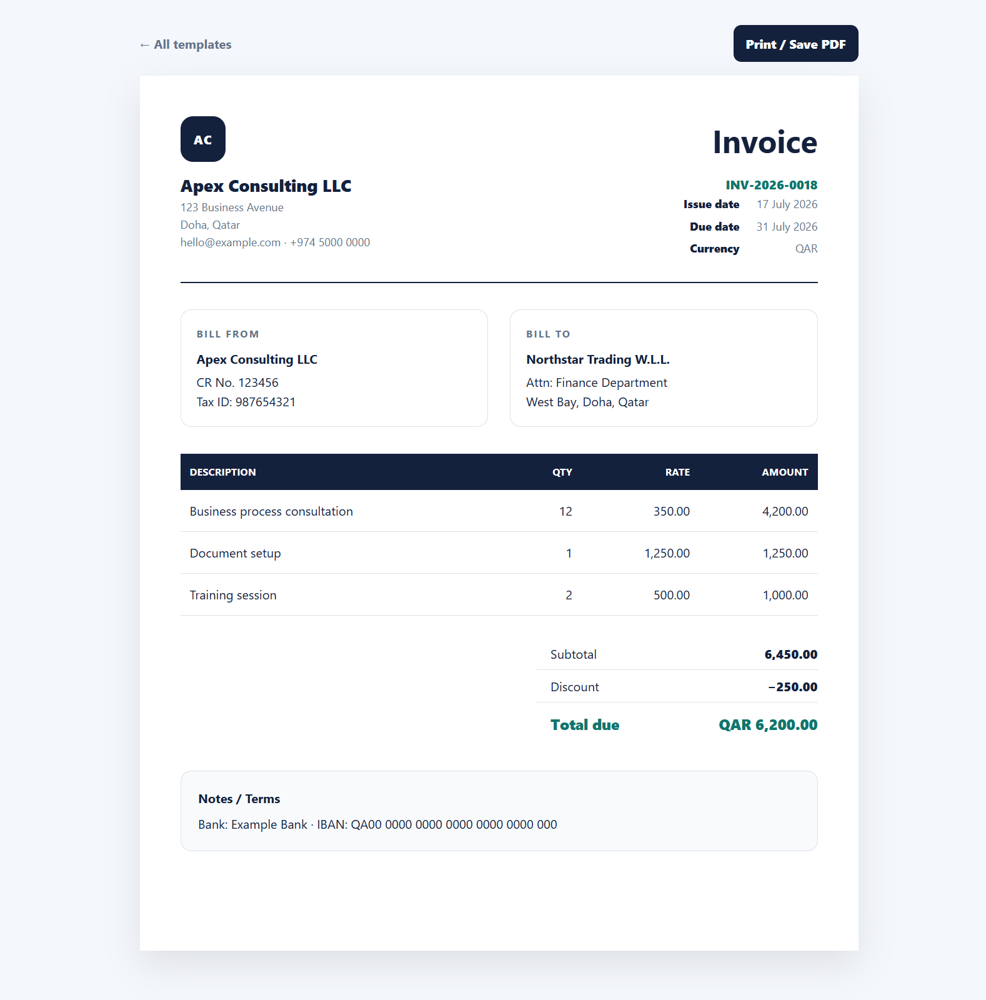
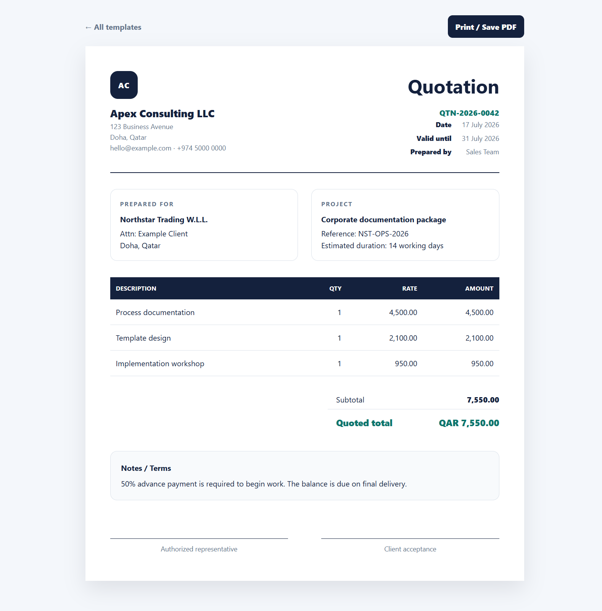
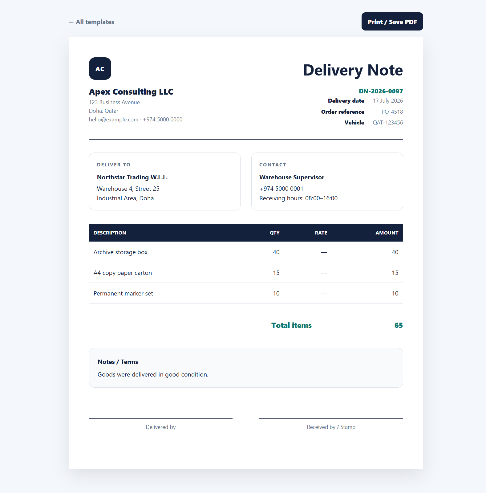
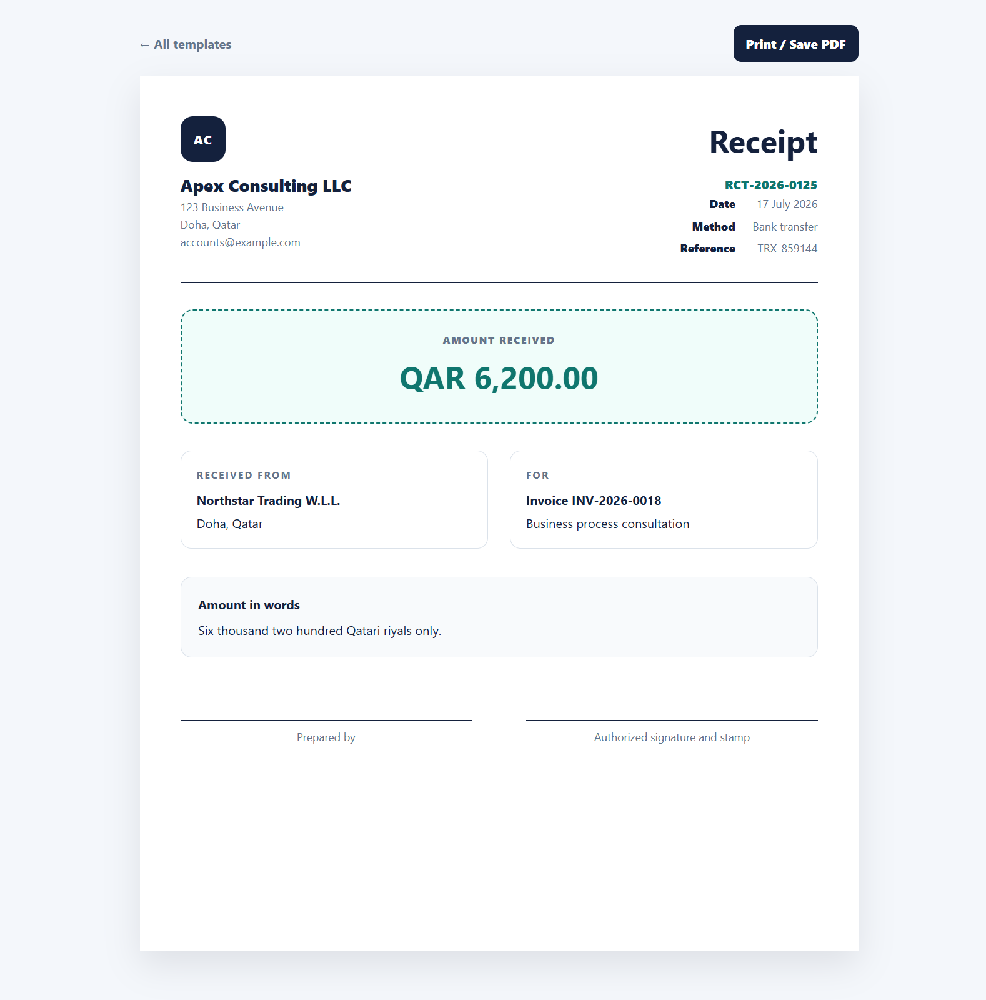

# Business Document Templates

A clean, responsive and print-ready collection of business document templates built with HTML and CSS.

[](https://fatiboams.github.io/business-document-templates/)
[](LICENSE)
[](#technology)



## Overview

Business Document Templates provides professional, editable and A4 print-ready layouts for common business documents. Each template works directly in the browser and can be printed or saved as a PDF without a framework, package installation or build process.

## Included templates

- Invoice
- Quotation
- Delivery note
- Receipt

## Template previews

### Invoice



### Quotation



### Delivery note



### Receipt



## Features

- Professional corporate layouts
- A4 print optimization
- Print and save-as-PDF support
- Responsive browser presentation
- Editable sample content
- Shared CSS design system
- Clear company, client and document information sections
- Item tables, totals and payment details
- Signature and acknowledgement areas
- No framework or build step
- No account, database or backend required

## Live demo

Open the template gallery:

**https://fatiboams.github.io/business-document-templates/**

Direct template pages:

- **Invoice:** https://fatiboams.github.io/business-document-templates/templates/invoice.html
- **Quotation:** https://fatiboams.github.io/business-document-templates/templates/quotation.html
- **Delivery note:** https://fatiboams.github.io/business-document-templates/templates/delivery-note.html
- **Receipt:** https://fatiboams.github.io/business-document-templates/templates/receipt.html

## Using a template

1. Open the required HTML file.
2. Replace the sample company and client information.
3. Edit the document number, dates, items, totals and terms.
4. Open the page in a modern browser.
5. Select **Print / Save PDF**.
6. Choose a printer or the browser's **Save as PDF** option.

## Customization

Shared typography, spacing, colors and print rules are located in:

```text
assets/styles.css
```

Document content is stored directly inside each template file:

```text
templates/invoice.html
templates/quotation.html
templates/delivery-note.html
templates/receipt.html
```

Replace the example values with your own business information. Review all calculations and legal or tax requirements before issuing a real document.

## Project structure

```text
business-document-templates/
├── assets/
│   └── styles.css
├── docs/
│   ├── business-document-templates-gallery.png
│   ├── invoice-template-preview.png
│   ├── quotation-template-preview.png
│   ├── delivery-note-template-preview.png
│   └── receipt-template-preview.png
├── templates/
│   ├── invoice.html
│   ├── quotation.html
│   ├── delivery-note.html
│   └── receipt.html
├── index.html
├── .gitignore
├── LICENSE
└── README.md
```

## Technology

- Semantic HTML
- Responsive CSS
- CSS Grid and Flexbox
- A4 `@page` print rules
- Browser print API
- GitHub Pages

## Important notice

These templates are general examples and are not legal, accounting or tax advice. Users are responsible for adapting the content to local regulations, tax rules, currency requirements and business practices.

## Roadmap

- [ ] Proforma invoice
- [ ] Purchase order
- [ ] Credit note
- [ ] Debit note
- [ ] Letterhead
- [ ] Payment voucher
- [ ] Multiple visual themes
- [ ] Optional editable form interface
- [ ] Automatic totals using JavaScript
- [ ] Currency and tax configuration
- [ ] Automated print-layout tests

## Contributing

Bug reports, accessibility improvements, new templates and pull requests are welcome. Use fictional information in public examples and issues.

## License

Released under the [MIT License](LICENSE).
